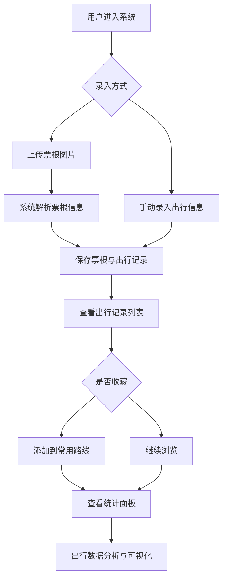

## 1. 产品概述
城市公交地铁票根存档系统——一款模拟车票纹理与地铁线路元素的全栈应用，帮助用户数字化存档公交/地铁票根、记录出行路线、统计出行时间，并收藏常用路线。
- 目标用户：日常通勤者、出行爱好者、收集票根的用户
- 核心价值：将纸质票根数字化归档，提供出行数据可视化统计，打造城市交通风格的沉浸式体验

## 2. 核心功能

### 2.1 用户角色
无需用户角色区分，单用户本地使用

### 2.2 功能模块
1. **票根存档页**：票根图片上传、票根列表展示、票根详情查看
2. **出行记录页**：出行路线记录、路线列表、常用路线收藏
3. **统计面板页**：出行时间统计、出行频次统计、路线偏好分析

### 2.3 页面详情
| 页面名称 | 模块名称 | 功能描述 |
|----------|----------|----------|
| 票根存档页 | 票根上传 | 支持图片上传，识别线路、站点、时间等信息 |
| 票根存档页 | 票根列表 | 以车票卡片形式展示所有票根，支持分页与筛选 |
| 票根存档页 | 票根详情 | 查看票根大图、关联出行记录、编辑备注 |
| 出行记录页 | 路线记录 | 手动录入或从票根自动生成出行路线 |
| 出行记录页 | 路线列表 | 展示出行记录，支持按时间/线路/类型筛选 |
| 出行记录页 | 常用路线 | 收藏常用路线，快速查看和使用 |
| 统计面板页 | 时间统计 | 按日/周/月统计出行时长和次数 |
| 统计面板页 | 路线偏好 | 展示最常乘坐的线路与站点 |
| 统计面板页 | 数据概览 | 出行总次数、总时长、收藏路线数等 |

## 3. 核心流程

用户打开系统 → 上传票根图片或手动录入出行信息 → 系统保存票根并生成出行记录 → 用户查看出行记录列表 → 收藏常用路线 → 查看统计面板了解出行数据

## 4. 用户界面设计

### 4.1 设计风格
- 主色调：深蓝(#1A5CD6) + 浅蓝(#4A90E2)
- 辅助色：灰色(#6B7280) + 浅灰(#E5E7EB)
- 背景色：白色(#FFFFFF) + 极浅蓝(#F0F5FF)
- 按钮风格：圆角矩形，蓝色主按钮带轻微阴影
- 字体：标题使用等宽字体(模拟站牌)，正文使用无衬线字体
- 布局风格：顶部导航栏 + 左侧线路色带装饰 + 卡片式内容区
- 图标风格：线性图标，配合地铁线路色标

### 4.2 页面设计概览
| 页面名称 | 模块名称 | UI元素 |
|----------|----------|--------|
| 票根存档页 | 票根上传 | 拖拽上传区域，虚线边框，地铁线路色带装饰 |
| 票根存档页 | 票根卡片 | 车票纹理背景，齿孔边缘，站点标签，线路色标 |
| 票根存档页 | 筛选栏 | 下拉筛选(线路/类型/时间)，蓝色搜索按钮 |
| 出行记录页 | 路线卡片 | 地铁线路图样式，站点连线，时间轴布局 |
| 出行记录页 | 收藏按钮 | 星标图标，点击切换收藏状态 |
| 统计面板页 | 统计卡片 | 蓝色渐变背景，大数字展示，趋势箭头 |
| 统计面板页 | 图表区域 | 简约柱状图/折线图，蓝灰色系 |

### 4.3 响应式设计
桌面优先设计，平板与手机端自适应布局，触控优化

### 4.4 特色视觉元素
- 票根卡片：模拟真实车票的齿孔边缘(CSS锯齿裁切)、纹理背景
- 地铁线路色标：每条线路对应不同颜色圆点标记
- 站牌风格标题：等宽字体模拟站名牌
- 线路连线：CSS绘制的站点间连线，模拟地铁线路图
