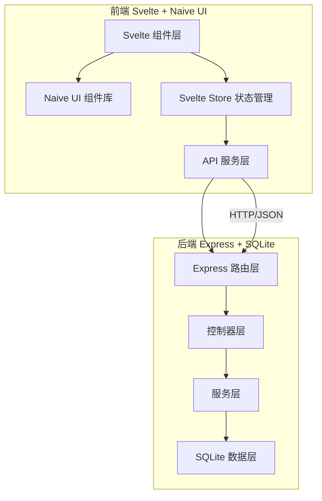
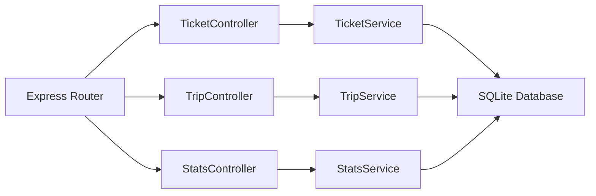
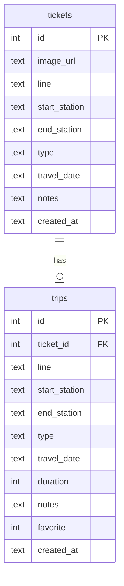

## 1. 架构设计



## 2. 技术说明
- 前端：Svelte@4 + Naive UI + Vite
- 初始化工具：Vite (Svelte 模板)
- 后端：Express@4 + TypeScript (ESM)
- 数据库：SQLite (better-sqlite3)
- 文件上传：multer
- 项目结构：Monorepo，前端 `src/`，后端 `api/`

## 3. 路由定义
| 路由 | 用途 |
|------|------|
| / | 票根存档页 - 票根上传与列表 |
| /routes | 出行记录页 - 路线记录与收藏 |
| /stats | 统计面板页 - 出行数据分析 |

## 4. API 定义

### 4.1 票根相关
| 方法 | 路径 | 说明 | 请求参数 | 响应 |
|------|------|------|----------|------|
| GET | /api/tickets | 获取票根列表(分页+筛选) | page, pageSize, line, type, startDate, endDate | { data: Ticket[], total: number } |
| POST | /api/tickets | 上传票根 | FormData: image, line, startStation, endStation, type, travelDate, notes | Ticket |
| GET | /api/tickets/:id | 获取票根详情 | - | Ticket |
| PUT | /api/tickets/:id | 更新票根信息 | { line, startStation, endStation, type, travelDate, notes } | Ticket |
| DELETE | /api/tickets/:id | 删除票根 | - | { success: boolean } |

### 4.2 出行记录相关
| 方法 | 路径 | 说明 | 请求参数 | 响应 |
|------|------|------|----------|------|
| GET | /api/trips | 获取出行记录(分页+筛选) | page, pageSize, line, type, startDate, endDate, favorite | { data: Trip[], total: number } |
| POST | /api/trips | 创建出行记录 | { line, startStation, endStation, type, travelDate, duration, notes } | Trip |
| PUT | /api/trips/:id/favorite | 切换收藏状态 | - | Trip |
| DELETE | /api/trips/:id | 删除出行记录 | - | { success: boolean } |

### 4.3 统计相关
| 方法 | 路径 | 说明 | 请求参数 | 响应 |
|------|------|------|----------|------|
| GET | /api/stats/overview | 数据概览 | - | { totalTrips, totalDuration, favoriteCount, lineCount } |
| GET | /api/stats/by-period | 按时段统计 | period: day/week/month, startDate, endDate | { labels: string[], counts: number[], durations: number[] } |
| GET | /api/stats/top-lines | 热门线路排行 | limit | { line: string, count: number }[] |

### 4.4 TypeScript 类型定义
```typescript
interface Ticket {
  id: number
  imageUrl: string
  line: string
  startStation: string
  endStation: string
  type: 'bus' | 'metro'
  travelDate: string
  notes: string
  createdAt: string
}

interface Trip {
  id: number
  ticketId: number | null
  line: string
  startStation: string
  endStation: string
  type: 'bus' | 'metro'
  travelDate: string
  duration: number
  notes: string
  favorite: boolean
  createdAt: string
}

interface PaginatedResponse<T> {
  data: T[]
  total: number
  page: number
  pageSize: number
}
```

## 5. 服务端架构图



## 6. 数据模型

### 6.1 数据模型定义



### 6.2 数据定义语言
```sql
CREATE TABLE IF NOT EXISTS tickets (
  id INTEGER PRIMARY KEY AUTOINCREMENT,
  image_url TEXT NOT NULL,
  line TEXT NOT NULL,
  start_station TEXT NOT NULL,
  end_station TEXT NOT NULL,
  type TEXT NOT NULL CHECK(type IN ('bus', 'metro')),
  travel_date TEXT NOT NULL,
  notes TEXT DEFAULT '',
  created_at TEXT DEFAULT (datetime('now'))
);

CREATE TABLE IF NOT EXISTS trips (
  id INTEGER PRIMARY KEY AUTOINCREMENT,
  ticket_id INTEGER,
  line TEXT NOT NULL,
  start_station TEXT NOT NULL,
  end_station TEXT NOT NULL,
  type TEXT NOT NULL CHECK(type IN ('bus', 'metro')),
  travel_date TEXT NOT NULL,
  duration INTEGER DEFAULT 0,
  notes TEXT DEFAULT '',
  favorite INTEGER DEFAULT 0,
  created_at TEXT DEFAULT (datetime('now')),
  FOREIGN KEY (ticket_id) REFERENCES tickets(id) ON DELETE SET NULL
);

CREATE INDEX IF NOT EXISTS idx_tickets_line ON tickets(line);
CREATE INDEX IF NOT EXISTS idx_tickets_type ON tickets(type);
CREATE INDEX IF NOT EXISTS idx_tickets_travel_date ON tickets(travel_date);
CREATE INDEX IF NOT EXISTS idx_trips_line ON trips(line);
CREATE INDEX IF NOT EXISTS idx_trips_type ON trips(type);
CREATE INDEX IF NOT EXISTS idx_trips_travel_date ON trips(travel_date);
CREATE INDEX IF NOT EXISTS idx_trips_favorite ON trips(favorite);
CREATE INDEX IF NOT EXISTS idx_trips_ticket_id ON trips(ticket_id);
```
